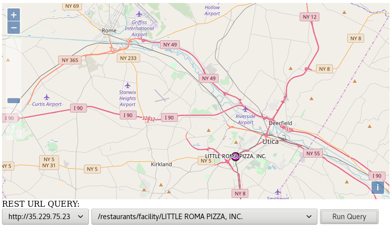

# Flask GIS Demo https://github.com/mikequentel/flask-gis-demo

* A reference implementation of a REST-exposed GIS server using Flask. Includes use of PostgreSQL database. It is a proof-of-concept and a demo of how one can implement a REST GIS server. It is not meant to be a robust, production-quality solution, but rather an example and potential starting point for future projects.
* Based on https://github.com/mikequentel/chalice-gis-demo but not using Chalice. Instead, this demo is meant to be deployed as either a Docker container by itself, or in conjunction with an orchestration platform like Kubernetes.
* Database: [PostgreSQL](https://www.postgresql.org)
  * Based on restaurant inspection data, from several years ago (circa 2013), collected by the state of New York and shared at the USA government website [data.gov](https://www.data.gov)
    * This is publicly available information published by the US government.
  * The backend database for this demo does not include PostGIS at this time.
  * Contains a flat table named `restaurants`--not a normalised database, for simplicity of the demo.
* Connection to database: [psycopg2](http://initd.org/psycopg)
* Circle distance calculation uses the libraries [geographiclib](https://pypi.python.org/pypi/geographiclib) and [geopy](https://pypi.python.org/pypi/geopy)

# Interfaces
## Note about the REST interfaces
* At this time, the interfaces are GET (read-only) actions.

## Examples of included interfaces--one exists for each field in the database.
* Select top (limit) of items **/restaurants/limit/{limit}** eg: http://35.229.75.23/restaurants/limit/100
* Select by object ID **/restaurants/oid/{oid}** eg: http://35.229.75.23/restaurants/oid/1441071
* Select by circle (items within the circle), with parameters latitude, longitude, and radius in km **/restaurants/circle/{circle}** eg: http://35.229.75.23/restaurants/circle/43.1009,-75.2327,150.5
* Select by bounding box (items within bounding box), with parameters upper left latitude, upper left longitude, lower right latitude, lower right longitude **/restaurants/bbox/{bbox}** eg: http://35.229.75.23/restaurants/bbox/43.000000,-79.000000,41.000000,-71.000000
* Select by facility (restaurant) name **/restaurants/facility/{facility}** eg: http://35.229.75.23/restaurants/facility/LITTLE%20ROMA%20PIZZA,%20INC%2E
* Select by county containing facilities of interest **/restaurants/county/{county}** eg: http://35.229.75.23/restaurants/county/ONEIDA

# Hacking

## Prerequisites
* PostgreSQL
* Python (version 2.7 was used for the demo but you could use 3 instead)
* Pip
* Virtualenv
* Flask

## Steps
1. Clone the Git repository: `git clone https://github.com/mikequentel/flask-gis-demo.git`
2. Enable the Virtual Environment (via `virtualenv`) and then load the pre-requisite libraries: `pip install -r requirements.txt`
3. Install a local copy of the database `businesses` which contains the table `restaurants` by using the plain text dump `data/businesses_backup.sql`--example: assuming database named `businesses` already exists (that is, you already created the database), then for user `postgres`, run the command: `psql -U postgres -h localhost --set ON_ERROR_STOP=on businesses < businesses_backup.sql`
4. Set the appropriate credentials, which set environment variables used to connect to the database.
5. Start the server locally by running `export FLASK_APP=app.py; flask run` which will deploy the server to http://localhost:5000
6. Now, you can run queries against the server through any HTTP client, but most easily through using the example at `client/map.html`

## Running via Docker
1. Install and configure the database `businesses` which has the table `restaurants`, as mentioned in the Hacking steps, and run the PostgreSQL service.
2. Run the script `rundocker.sh`, which has commands for running the demo in a Docker container, serving over port `8888`, so you can access it at http://localhost:8888

# Deploying to Google Cloud GKE

## Prerequisites
* Account at Google Cloud
* Google Cloud Shell (can run in web browser) or `gcloud` and `kubectl` installed (for running commands locally).

## Steps
1. Create a Google CloudSQL database and load it with a PostgreSQL dump (such as the SQL file at `data/businesses_backup.sql`).
2. Enable (for non-production purposes) public access to the CloudSQL...for Production purposes, use a proxy as described at: https://cloud.google.com/sql/docs/mysql/connect-kubernetes-engine
   * **AUTHORISATION** tab-->**Authorised networks**-->**Add network**
   * Add `0.0.0.0/0`
   * Save
3. Update the Dockerfile to include the database connection credential environment variables: `DB_URL`, `DB_USER`, `DB_PASSWD`
4. See the steps described in these Google tutorials for getting started with GKE:
   * https://cloud.google.com/kubernetes-engine/docs/tutorials/hello-app
   * https://cloud.google.com/kubernetes-engine/docs/quickstart
